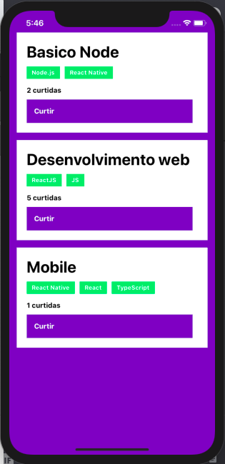
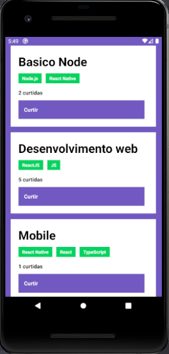

<div align="center">
  
  
</div>

<h1 align="center">
  Save repositories - Mobile
</h1>


## :pushpin: Tecnologias 

Esse projeto foi desenvolvido com as seguintes tecnologias:

- [React Native](https://reactnative.dev/)
- [Axios](https://github.com/axios/axios)

## :computer: Projeto

Aplicação para armazenar repositórios do seu portfólio, que permite listagem e dar like para um repositório.  

<div align="center">
  <div style="float: left; width: 50%">
    <h3>IOS</h3>
    
    </div>
  <div style="float: left; width: 50%">
    <h3>Android</h3>
    
  </div>
</div>  

<br />
<br />

## :point_down: Executando o projeto

No seu terminal copie e cole ou digite o comando abaixo:

```git
git clone https://github.com/jhowsantos/save-repositories-mobile.git
````

Após realizar o clone acesse a pasta do projeto:

```git
cd save-repositories-mobile
````

Logo em seguida digite o comando __*yarn*__ para baixar e atualizar as dependências do projeto  

Para executar o projeto digite em seu terminal o comando:

__*Para Android*__  

```terminal
yarn android
````

__*Para IOS*__  

```terminal
yarn ios
````  

_Lembre-se que para executar esse projeto é necessário ter o backend rodando_  
[__*Acesse o backend aqui*__](https://github.com/jhowsantos/save-repositories-backend.git)

---
Feito com coração, café e muito esforço :heart: :rocket: